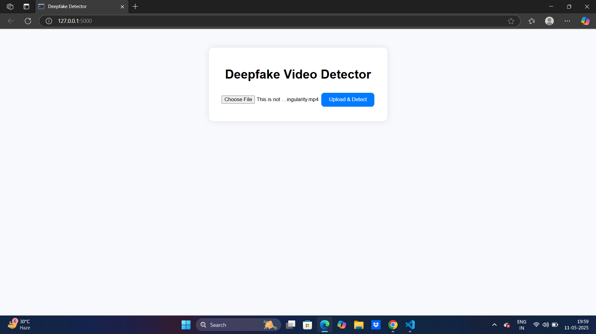
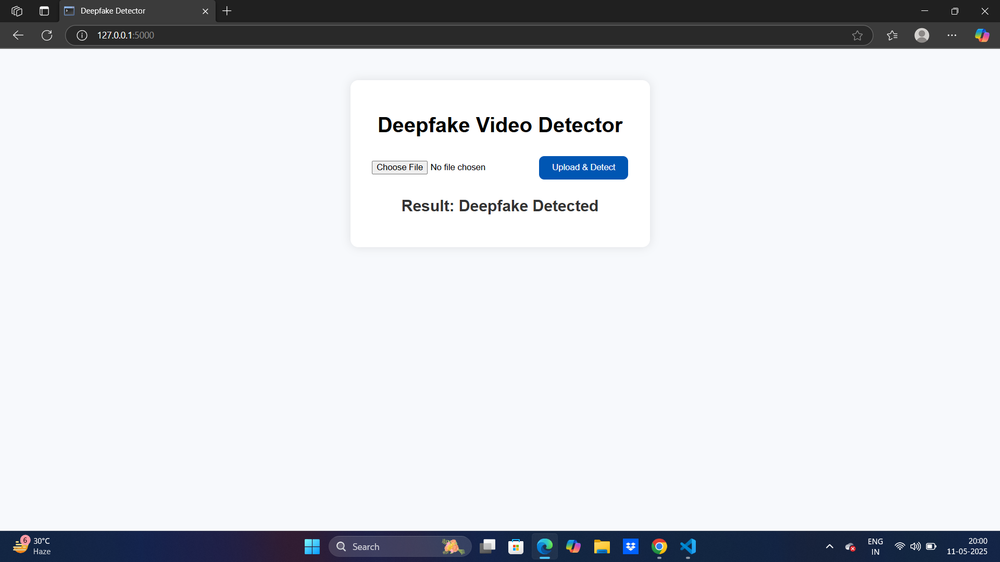

# Deepfake Detection Website

## Problem Statement

In recent years, deepfake technology has become increasingly sophisticated, making it difficult for individuals and organizations to distinguish between genuine and manipulated media. Deepfakes are AI-generated videos, images, or audio that have been manipulated to deceive viewers. They are used for malicious purposes, including misinformation, fraud, and identity theft. There is an urgent need for accessible, reliable, and automated tools that can help detect deepfakes and prevent their harmful effects.

This project provides a **web-based deepfake detection tool** that allows users to upload videos and determine if the content has been altered. The solution leverages machine learning models (TensorFlow and OpenCV) to analyze and classify video content, offering a user-friendly interface for non-technical users.

## Solution

The Deepfake Detection Website uses a **pre-trained deepfake detection model** to process uploaded video files and classify them as genuine or manipulated. The system integrates:
- **Flask** for backend functionality.
- **TensorFlow** for deepfake detection using pre-trained neural networks.
- **OpenCV** for video processing and frame extraction.

The application provides a simple user interface where users can upload videos and receive real-time results on the authenticity of the video.

## Features

- **Video Upload**: Allows users to upload video files for analysis.
- **Deepfake Detection**: Uses machine learning models to analyze and detect deepfakes.
- **Results Display**: Displays prediction results with a confidence score, indicating whether the video is real or manipulated.

## Setup Instructions

### Prerequisites

1. Python 3.x
2. Flask
3. TensorFlow
4. OpenCV
5. Other dependencies (see `requirements.txt`)

### Step 1: Clone the Repository

Clone the repository to your local machine:
```bash
git clone https://github.com/sid551/deepfake-video-detector.git
```

### Step 2: Install Dependencies

Navigate to the project directory and install the required dependencies:
```bash
cd deepfake-video-detection
pip install -r requirements.txt
```

### Step 3: Run the Application

Start the Flask server:
```bash
python app.py
```

The application should now be running on `http://127.0.0.1:5000/`. You can access the website by navigating to this address in your browser.

### Step 4: Upload Videos for Analysis

- Visit the website in your browser.
- Upload a video and click the "Analyze" button.
- The system will process the video and display whether it is a genuine or manipulated deepfake.

## Screenshots/Logs/Diagrams

### 1. **Homepage**


### 2. **Upload Page**


### 3. **Results Page**


### 4. **Logs**
```
[INFO] 127.0.0.1 - - [10/May/2025 12:34:56] "POST /upload HTTP/1.1" 200 -
[INFO] Video uploaded successfully. Processing video for deepfake detection...
[INFO] Deepfake detection complete. Result: Fake (Confidence: 98.5%)
```
### 5. **Demo Video**
[Watch Demo Video on YouTube](https://youtu.be/VPfdcHCr8G4)


## Contributing

If you'd like to contribute to the project:
1. Fork the repository.
2. Create a new branch.
3. Make your changes.
4. Submit a pull request.

## License

This project is licensed under the MIT License - see the [LICENSE](LICENSE) file for details.
